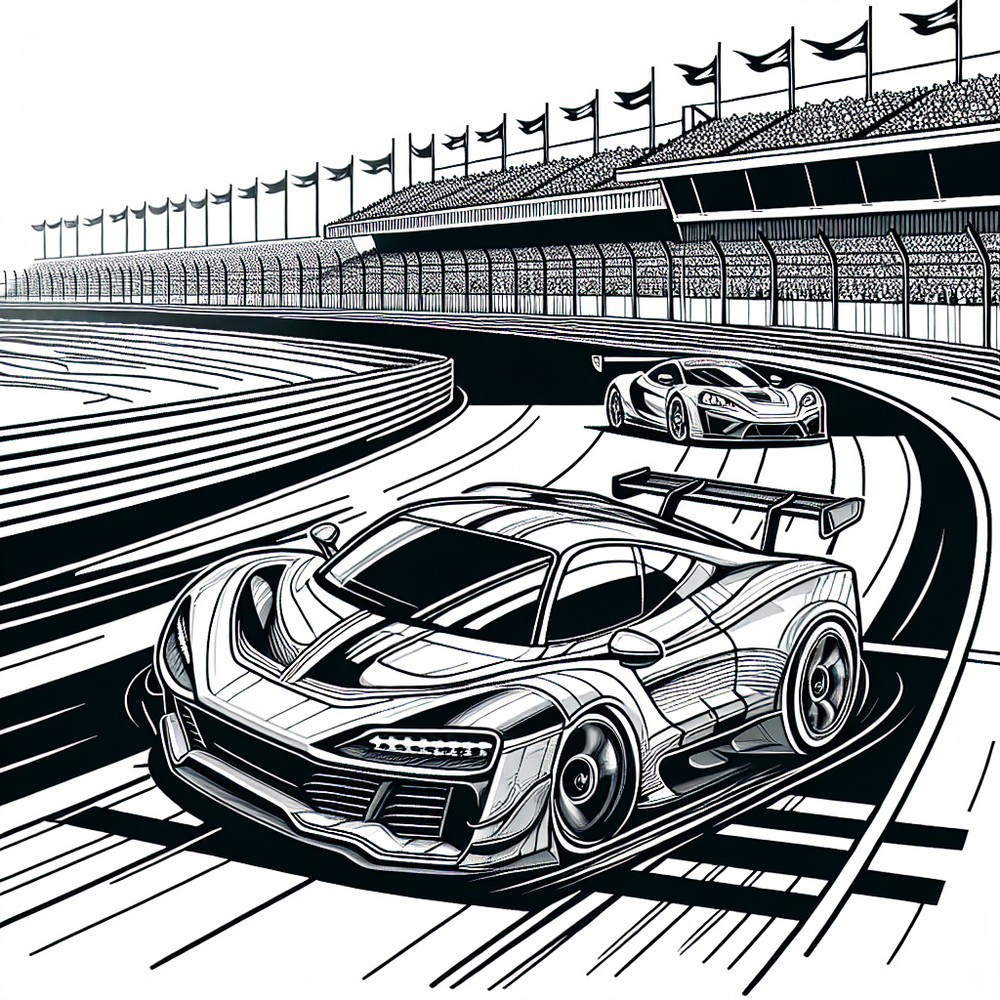

<div align="center">
  
</div>

<!-- BADGES START -->
<p align="left">
  <a href="https://www.python.org/">
    
  </a>
  <a href="https://streamlit.io/">
    
  </a>
  <a href="https://platform.openai.com/">
    
  </a>
  <a href="LICENSE">
    
  </a>
</p>
<!-- BADGES END -->


# Generator Kolorowanek AI

Aplikacja Streamlit do generowania czarno-białych kolorowanek dla dzieci z wykorzystaniem modeli OpenAI (DALL-E 3 oraz GPT-4o).

---


## Opis projektu

Ten projekt umożliwia każdemu użytkownikowi szybkie tworzenie oryginalnych kolorowanek na podstawie własnego pomysłu. Wystarczy podać temat i krótki opis sceny, a aplikacja:
- opcjonalnie ulepszy opis za pomocą GPT-4o (bez kolorów, dźwięków, zapachów),
- wygeneruje prompt i przekaże go do DALL-E 3,
- stworzy czarno-biały rysunek do kolorowania (line art, 1024x1024),
- osadzi rysunek na białym tle A4 (poziomo, PDF, bez marginesów),
- umożliwi pobranie gotowej kolorowanki w formacie PDF.

## Najważniejsze cechy
- **Czysto czarno-białe rysunki** – bez cieni, szarości, kolorów, wypełnień i marginesów.
- **Prosty, funkcjonalny interfejs** – tylko to, co potrzebne do generowania i pobierania kolorowanek.
- **Ulepszanie opisu przez AI** – jedno kliknięcie i Twój pomysł staje się bardziej szczegółowy, ale bez zbędnych kolorów, dźwięków i zapachów.
- **Plik PDF gotowy do druku** – idealny do domowego użytku, zajęć edukacyjnych lub prezentu.


## Jak uruchomić?

Możesz skorzystać z aplikacji na dwa sposoby:

1. **Bezpośrednio online:**
   - Kliknij i uruchom bez instalacji: [pokolorujmnie.streamlit.app](https://pokolorujmnie.streamlit.app/)

2. **Lokalnie z repozytorium:**
   - Sklonuj repozytorium:
     ```bash
     git clone https://github.com/AlanSteinbarth/Kolorowanki.git
     cd Kolorowanki
     ```
   - Zainstaluj wymagane biblioteki:
     ```bash
     pip install -r requirements.txt
     ```
   - Utwórz plik `.env` i dodaj swój klucz API OpenAI:
     ```env
     OPENAI_API_KEY=sk-...
     ```
   - Uruchom aplikację:
     ```bash
     streamlit run app.py
     ```


## Bezpieczeństwo

- Twój klucz API OpenAI **nie jest nigdzie zapisywany ani przechowywany** przez aplikację – jest używany wyłącznie w bieżącej sesji do komunikacji z API OpenAI.
- Aplikacja nie przesyła, nie loguje i nie udostępnia klucza osobom trzecim.
- Pamięć podręczna Streamlit (stan sesji) jest czyszczona po zamknięciu przeglądarki lub odświeżeniu aplikacji.
- Zalecamy nie udostępniać swojego klucza API innym osobom i nie commitować pliku `.env` do repozytorium.

## Wkład i licencja

Projekt na licencji MIT. Chcesz zgłosić błąd lub dodać funkcję? Zajrzyj do pliku [CONTRIBUTING.md](CONTRIBUTING.md)!

## Zrzuty ekranu

<div align="center">
  <a href="screenshots/kolorowanka_Samochody_wyścigowe.pdf">
    
  </a>
  <br><i>Podgląd finalnego pliku PDF z kolorowanką. Kliknij, aby pobrać przykładowy PDF.</i>
</div>

<div align="center">
  
  <br><i>Panel boczny z polem na klucz API oraz komunikat o poprawnym kluczu.</i>
</div>
<div align="center">
  
  <br><i>Wygenerowana kolorowanka (samochody wyścigowe) – podgląd i pobieranie PDF.</i>
</div>
<div align="center">
  
  <br><i>Przykład ulepszonego opisu przez AI na podstawie prostego opisu użytkownika.</i>
</div>
<div align="center">
  
  <br><i>Początkowy widok aplikacji – puste pola do wpisania tematu i opisu kolorowanki.</i>
</div>
<div align="center">
  
  <br><i>Komunikat o braku klucza API – aplikacja nie pozwala przejść dalej bez klucza.</i>
</div>

## Portfolio
Ten projekt jest częścią mojego portfolio programistycznego. Pokazuje praktyczne wykorzystanie AI, integrację z API, obsługę PDF oraz projektowanie prostych, użytecznych interfejsów w Pythonie.

Zachęcam do kontaktu i współpracy!

---
Autor: Alan Steinbarth
